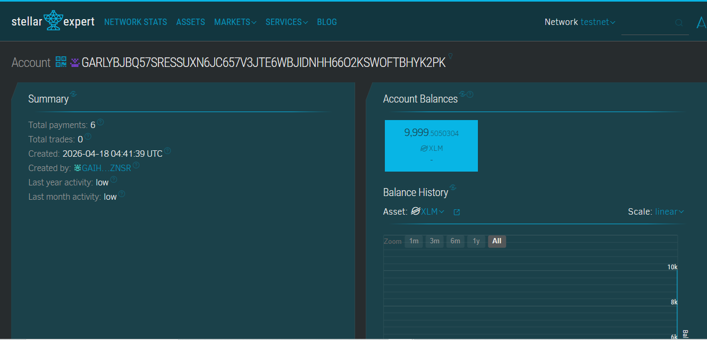
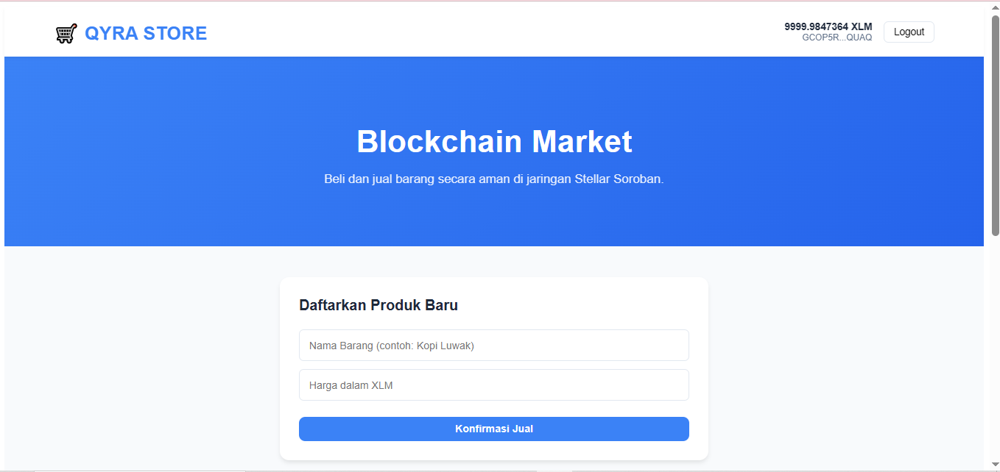

# Stellar Shoping Chain DApp

**Stellar Shoping Chain DApp** - Decentralized Marketplace on Stellar Blockchain

## Project Description

Stellar Shoping Chain is a decentralized smart contract solution built on the Stellar blockchain using the Soroban SDK. It enables users to sell, buy, and manage products securely and transparently on-chain. The contract ensures that all product data and transactions are handled through predefined smart contract functions, eliminating reliance on centralized servers or databases.

Each product has a unique ID and is stored permanently in the contract’s storage, ensuring security, reliability, and data integrity.

## Project Vision

Our vision is to build a decentralized e-commerce ecosystem that:

- **Empowers Ownership**: Sellers and buyers have full control over their products and transactions
- **Guarantees Transparency**: All marketplace activities can be verified on-chain
- **Ensures Security**: Protects against fraud or data manipulation by third parties
- **Enables Open Access**: Marketplace accessible globally without intermediaries
- **Creates Trustless Systems**: Data integrity guaranteed by code, not company promises

We envision a future where e-commerce is fair, transparent, and fully secure for all participants.

## Key Features

### 1. **Product Listing**

- Add products with a single function call
- Specify product name and price
- Automatic unique ID generation
- Persistent storage on Stellar blockchain

### 2. **2. Browse Products**

- Fetch all available products in one call
- Structured data format for easy frontend integration
- Quick access to the full product catalog

### 3. **Purchase Products**

- Buy products by their unique ID
- Users cannot buy their own products
- Product is permanently removed from storage upon purchase
- Marketplace state updates immediately after transactions

### 4. **Transparency and Security**

- All marketplace actions recorded on blockchain
- On-chain verification of product listings and purchases
- Immutable records prevent unauthorized changes

### 5. **Stellar Network Integration**

- High-speed, low-cost Stellar transactions
- Built with Soroban Smart Contract SDK
- Scalable for growing product catalogs
- Interoperable with other Stellar-based services

## Contract Details

Contract Address: CBIH5CKXJMCJALNSLXTQB55ZSJHHIEVLTJPA4ABLOA6JUEBCUVRRHNRK
  

## Frontend Preview

## Future Scope

### Short-Term Enhancements

1. **Product Categories**: Add tags or categories for better organization
2. **Rich Descriptions**: Support for detailed product descriptions and formatted text
3. **Search Functionality**: Advanced search filters for large catalogs
4. **User Ratings & Reviews**: Build seller reputation

### Medium-Term Development

5. **Promotions & Discounts**: Support vouchers and discounts
6. **Notification System**: Off-chain notifications for purchases or new products
7. **Digital Asset Integration**: Attach NFTs or tokens to products
8. **Inter-Contract Integration**: Allow other smart contracts to interact with products

### Long-Term Vision

9. **Cross-Chain Marketplace**: Extend product listings to multiple blockchains
10. **Decentralized Frontend Hosting**: Host frontend on IPFS or similar platforms
11. **AI Recommendations**: Suggest products to buyers using AI
12. **DAO Governance**: Community-driven feature prioritization and upgrades
13. **Decentralized Identity (DID)**: Integration for user management

### Enterprise Features

14. **Corporate Marketplaces**: Adapt for internal business or inventory management
15. **Immutable Transaction Logging**: Time-stamped logs for auditing
16. **Automated Reporting**: Trigger-based sales reports
17. **Multi-Language Support**: Expand accessibility globally

---

## Technical Requirements

- Soroban SDK
- Rust programming language
- Stellar blockchain network

## Getting Started

Deploy the smart contract to the Soroban Stellar network and interact with it using the three main functions:

- `create_product()` – Add a new product with name and price
- `get_products()` – Retrieve all products stored in the contract
- `buy_product()` – Purchase a product by its unique ID

---

**Stellar Shoping Chain DApp** – Secure, Transparent, and Decentralized Marketplace
